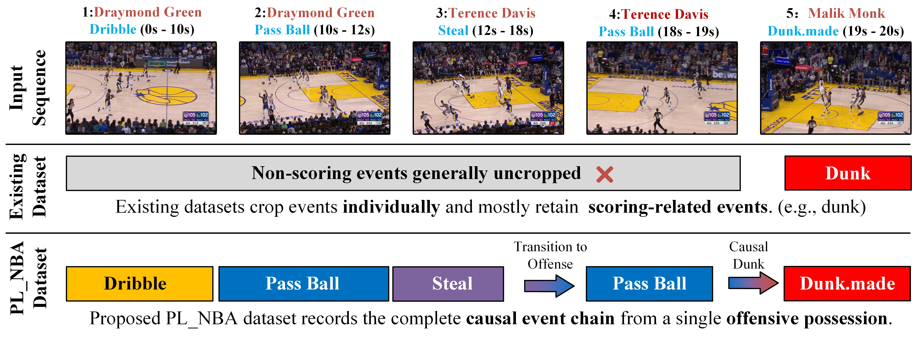
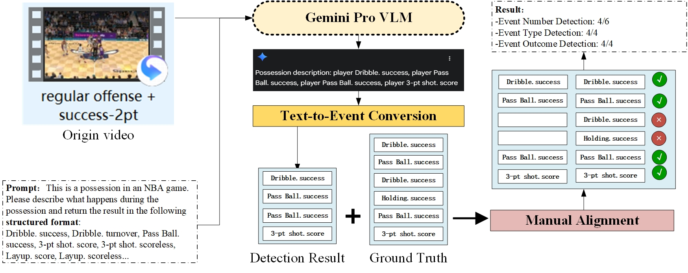

# PL-NBA🏀: A Possession-level Universal Basketball Video Dataset

## Project Introduction
PL-NBA is the first possession-level basketball video dataset for multi-task sports visual understanding. Most existing basketball datasets only annotate isolated single events, which cannot preserve the temporal continuity and tactical context of real games, and cannot support complex tasks such as action anticipation and tactical analysis.

  
   

PL-NBA is collected from 40 official NBA games🏀 (2022–2025 season), covering all 30 NBA teams. It contains 7,000+ complete offensive possession clips (average 12.11s) and 30,000+ fine-grained annotated events, with rich annotations including event type, player name, timestamp, event outcome and textual caption.

The dataset retains the complete temporal logic of offensive possessions and provides high-quality data support for various visual understanding tasks, becoming a challenging and practical benchmark for basketball video analysis research.

## Key Highlights
🚩 **First possession-level sample**: Take a complete offensive possession as the basic unit, fully preserving the temporal continuity and tactical integrity of the game！
🚩 **Rich fine-grained annotations**: Cover 13 sub-event categories and 22 outcome-labeled types, with player name, timestamp, event result and LLM-generated text description！
🚩 **High-quality standardized data**: Unified overhead court perspective, filtered out non-game footage; 3 experts independently annotate and reach consensus to ensure accuracy！
🚩 **Support multiple visual tasks**: Support event recognition, video captioning, temporal action localization, and the novel action anticipation task for basketball offense tendency prediction！
🚩 **High-definition multi-modal data**: 1080P video with 48kHz synchronized audio, supporting audio-related downstream tasks！
🚩 **Open-source and academic friendly**: Released under CC BY-NC 4.0 license, free for academic research, with standard data splits and preprocessing subsets!

## Data Access
We have uploaded the complete annotation files of the PL-NBA dataset to this GitHub repository✅. For the video data, you can choose to download the original NBA game🏀 videos on your own, as our annotations include detailed game information to help you locate and process the corresponding footage. If you are unable to download the original videos, you can send an email to holhouse@emails.bjut.edu.cn to obtain the pre-trimmed video clips we have processed.

⭐️**Important Note**: This dataset is strictly limited to scientific research use only. 🙅‍🚫Any commercial utilization of the dataset is prohibited🙅‍🚫

## Fine-grained Event Recognition
**Fine-grained Event Recognition** is a **novel video understanding task** tailored for the **PL-NBA dataset** that targets sequential event perception in complete basketball offensive possessions. Unlike conventional event recognition that only identifies single independent actions, this task aims to detect and classify all sub-events in chronological order within a full offensive possession, including their types and corresponding outcomes, while retaining the complete temporal causal relationship and tactical logic of the game. It evaluates model performance from two critical dimensions: possession-level accuracy (whether all sub-events in a possession are fully and correctly identified) and event-level accuracy (the ratio of correctly recognized sub-events to the total number of sub-events), which poses higher requirements for models’ long-sequence video modeling capability and fine-grained multi-event linkage perception ability, and provides a new evaluation paradigm for tactical-oriented basketball video analysis.

  
   

This experiment conducts verification for possession-level successive event recognition based on the PL-NBA dataset, aiming to evaluate the model's sequential perception capability of temporal sub-events within complete basketball offensive possessions. We select 200 finely annotated offensive possession samples (containing 892 sub-events) from the dataset, adopt the Gemini Pro vision-language model as the baseline, and directly input the complete possession videos under the zero-shot and no extra fine-tuning setting. Event recognition is accomplished relying on the model's long-sequence understanding and multimodal reasoning capabilities.

  
   

The experiment is evaluated from two dimensions: possession-level and event-level. The possession-level accuracy judges whether all sub-events in a single possession are completely and correctly identified, while the event-level accuracy calculates the overall correct recognition rate of sub-events. The final experimental results show that the possession-level full-matching accuracy is 27.00% and the event-level recognition accuracy reaches 60.76%, which verifies the effectiveness of large models in event perception for long-sequence basketball videos, and also reveals that there is still large room for optimization in successive event recognition under scenarios such as fast-paced offense and intensive passing and cutting.

